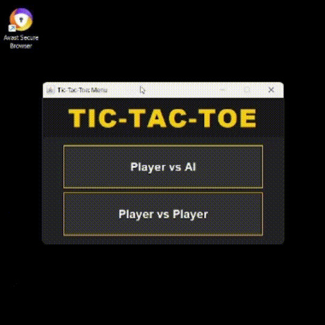
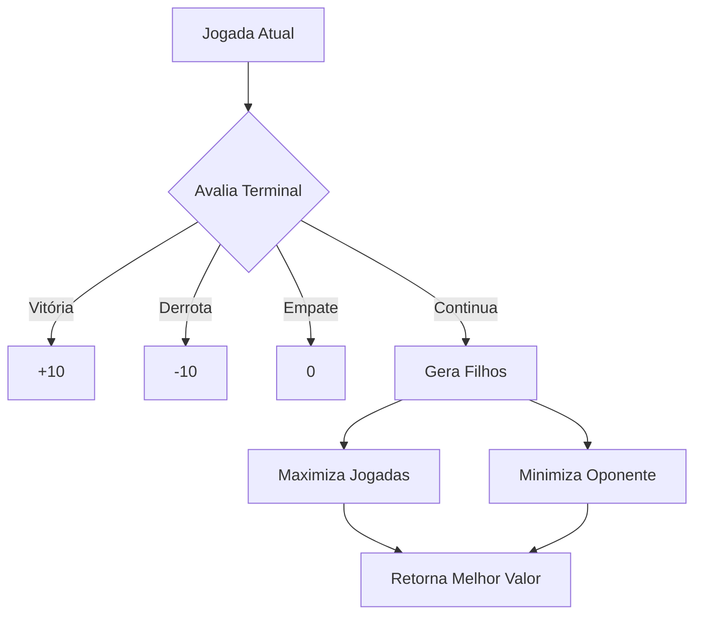

# Tic-Tac-Toe com IA (Java)

<p align="center">
  
</p>

## Sumário
- [Funcionalidades](#-funcionalidades)
- [Algoritmo Minimax](#-algoritmo-minimax)
- [Demonstração](#-demonstração)
- [Regras do Jogo](#-regras-do-jogo)
- [Estrutura do Código](#️-estrutura-do-código)
- [Como Executar](#-como-executar)

---

## Funcionalidades

### Modos de Jogo
- **PvP** (Jogador vs Jogador)
- **PvE** (Jogador vs IA - Minimax)

### Destaques
```diff
+ Interface gráfica moderna com Swing
+ Sistema de pontuação persistente
+ Feedback visual de vitória/empate
+ Botões de controle (Reiniciar/Voltar)
```

--- 

## Algoritmo Minimax

O Minimax é um algoritmo que simula todas as jogadas possíveis alternando entre dois comportamentos: maximizar (para a IA) e minimizar (para o jogador humano). Ele avalia cada possibilidade até encontrar um estado terminal (vitória, derrota ou empate), atribuindo valores (+10 para vitória da IA, -10 para derrota, 0 para empate) e propagando esses valores na árvore de decisão.



No código, a IA usa o Minimax para explorar o tabuleiro virtualmente, testando cada jogada possível e escolhendo a que leva ao melhor resultado garantido, independente das escolhas do jogador. A recursão alterna entre os turnos, simulando tanto as jogadas da IA (que busca maximizar a pontuação) quanto as do jogador (que buscaria minimizá-la).

A implementação evita modificar a interface gráfica durante as simulações, trabalhando com uma matriz lógica (boardState). Quando encontra a melhor jogada, a IA atualiza apenas o botão correspondente na thread gráfica principal, mantendo o jogo responsivo. A profundidade da análise garante que a IA nunca perca, apenas empate ou vença.

---

## Demonstração

### Modo Player vs Player (PvP)
<p align="center">
  
</p>
*Dois jogadores humanos alternam turnos - ✕ sempre começa*

### Modo Player vs IA (PvE)
<p align="center">
  
</p>
*Jogador (✕) vs IA (⭕) usando algoritmo Minimax - Observe a IA bloqueando jogadas vencedoras*


### Características Destacadas
| Feature               | PvP | PvE |
|-----------------------|-----|-----|
| Alternância de turnos | ✅  | ✅  |
| Feedback visual       | ✅  | ✅  |
| IA inteligente        | ❌  | ✅  |
| Placar dinâmico       | ✅  | ✅  |

---

## Regras do Jogo

### Objetivo
Ser o primeiro jogador a formar uma linha contínua de três símbolos iguais (✕ ou ⭕) na horizontal, vertical ou diagonal.

### Turnos e Símbolos
```diff
+ O jogador ✕ sempre começa
+ Os jogadores alternam turnos
+ Não é possível pular ou passar a vez
``` 

### Condições de Vitória
Um jogador vence quando consegue alinhar três símbolos na diagonal, vertical ou horizontal.

### Condições de Empate
O jogo termina em empate quando:
+ Todas as 9 casas estão preenchidas
+ Nenhum jogador formou uma linha vencedora
- Não é possível desfazer jogadas

--- 

## Estrutura do Código

```text
TicTacToe-Minimax-AI/
├── src/
│   ├── main/
│   │   └── java/
│   │       └── tictactoe/
│   │           ├── App.java         # Classe principal
│   │           └── TicTacToe.java   # Lógica do jogo (inclui IA)
│   └── resources/                   # Recursos
├── .gitignore
└── README.md
```

---

## Como Executar

### Pré-requisitos
- **Java JDK 17 ou superior**
- Terminal compatível (Linux, macOS ou Windows)

### Passos

```bash
# Navegue até a pasta com os arquivos-fonte
cd src/main/java

# Compile os arquivos Java
javac -d ../../../target/classes tictactoe/*.java

# Execute o programa principal
cd ../../../
java -cp target/classes tictactoe.App
