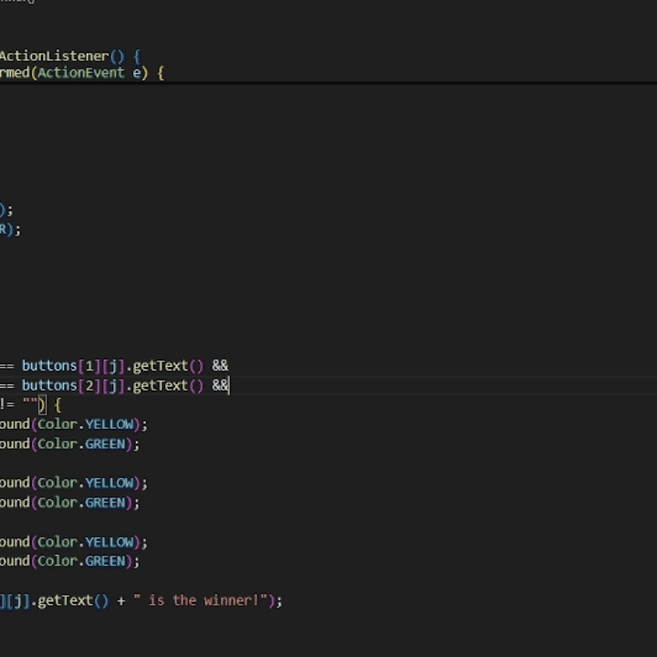

# Tic-Tac-Toe with Minimax AI

## Project Description
This project is a Tic-Tac-Toe game developed in Java, featuring an AI opponent that makes strategic decisions based on the Minimax state-space search algorithm. The game supports two play modes:
1. **Player vs. Player** - Two players take turns to compete against each other on the same machine.
2. **Player vs. Computer (AI)** - The player competes against a computer-controlled opponent using the Minimax algorithm to simulate strategic gameplay.

## Demo

## Features
- Graphical interface using Java Swing.
- Two game modes: Player vs. Player and Player vs. Computer.
- Minimax algorithm for AI decision-making.
- Real-time score tracking for both players.

## Requirements
- Java Development Kit (JDK) version 8 or higher.
- VSCode or another compatible IDE.