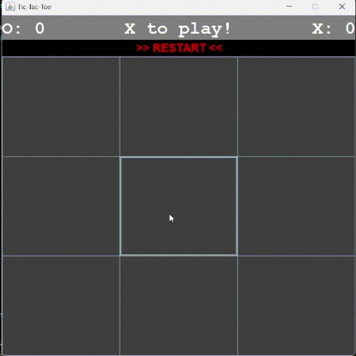

# Tic-Tac-Toe Implementations in Various Programming Languages  
This repository contains implementations of the Tic-Tac-Toe game in multiple programming languages.

## Demo (Java Implementation)  

## Implementations  
- **Java** (done)  
- **Python** (in progress)  
- **C++** (in progress)  
- **C** (not started)  
- **Ruby** (not started)  
- **Scala** (not started)  

## Structure  
Each folder follows the naming pattern: `tictactoe-<language>`.  
Inside each folder, you will find the source code and instructions for running the Tic-Tac-Toe implementation in that specific language.  
